# Quick Emergency Assessment - Containerized Flask Application


## 📋 Project Overview

This project demonstrates a **production-ready containerized Flask application** with automated CI/CD pipeline. The application is built with Python Flask, containerized using Docker, orchestrated with Docker Compose, and automatically built and pushed to Docker Hub via GitHub Actions.

---

## 🏗️ Architecture Diagram

```mermaid
graph TB
    User[👤 User Browser] -->|HTTP Request :9090| Host[🖥️ Host Machine]
    Host -->|Port Mapping 9090:5000| Docker[🐳 Docker Compose]
    Docker -->|Manages| Container[📦 Container quick-emergency-app]
    Container -->|Listens on| App[🐍 Flask App :5000]
    
    subgraph "Docker Environment"
        Docker
        Container
        App
    end
    
    subgraph "Port Flow"
        P1[Host Port: 9090] -->|Maps to| P2[Container Port: 5000]
        P2 -->|App listens on| P3[Flask Port: 5000]
    end
    
    subgraph "CI/CD Pipeline"
        GitHub[📁 GitHub Repository] -->|Trigger| Actions[⚙️ GitHub Actions]
        Actions -->|Build & Test| Image[🏗️ Docker Image]
        Image -->|Push| DockerHub[🐋 Docker Hub]
    end
    
    style User fill:#e1f5ff
    style Host fill:#fff4e1
    style Docker fill:#e3f2fd
    style Container fill:#f3e5f5
    style App fill:#e8f5e9
```



---

## 🎯 Application Features

### Endpoints

| Endpoint | Method | Description | Response |
|----------|--------|-------------|----------|
| `/` | GET | Returns app name and listening port | `{"app_name": "quick-emergency-app", "listening_port": "5000"}` |
| `/health` | GET | Health check endpoint | `{"status": "UP"}` |

### Key Features
- ✅ **Environment-driven configuration**: Port configured via `APP_PORT` environment variable
- ✅ **Graceful failure**: Application exits with clear error if `APP_PORT` is not set
- ✅ **Non-root user**: Runs as `appuser` for security
- ✅ **Lightweight**: Uses Python 3.11-slim base image
- ✅ **Logging**: All logs output to stdout/stderr

---

## 🔌 Port Configuration & Networking

### Understanding the Port Flow

This is one of the most critical aspects of containerized applications:

#### 1️⃣ **Application Port (5000)**
- **What**: The port Flask application binds to inside the container
- **Why**: Set via `APP_PORT` environment variable
- **Code**: `app.run(host="0.0.0.0", port=int(PORT))`

#### 2️⃣ **Container Port (5000)**
- **What**: The port exposed by the Docker container
- **Why**: Declared in Dockerfile with `EXPOSE ${APP_PORT}`
- **Purpose**: Documents which port the container listens on

#### 3️⃣ **Host Port (9090)**
- **What**: The port on your local machine
- **Why**: Mapped in docker-compose.yml as `"9090:5000"`
- **Access**: You access the app at `http://localhost:9090`

### Port Mapping Explanation

```yaml
ports:
  - "9090:5000"
    ↑      ↑
    │      └─ Container port (where Flask listens)
    └──────── Host port (where you access from browser)
```

**Traffic Flow:**
```
Browser → localhost:9090 → Docker maps to → Container:5000 → Flask App listening on 0.0.0.0:5000
```

**Why are they different?**
- **Flexibility**: Multiple containers can use port 5000 internally, mapped to different host ports
- **Security**: Prevents port conflicts on the host machine
- **Isolation**: Container networking is isolated from host networking

---

## 🐳 Docker Configuration

### Dockerfile Breakdown

```dockerfile
FROM python:3.11-slim          # Lightweight base image (~50MB vs ~900MB for full Python)
RUN useradd -m appuser         # Security: Create non-root user
WORKDIR /app                   # Set working directory
COPY requirements.txt .        # Copy dependencies first (Docker layer caching)
RUN pip install --no-cache-dir # Install without cache to reduce image size
COPY app.py .                  # Copy application code
USER appuser                   # Switch to non-root user
EXPOSE ${APP_PORT}             # Document the port (metadata only)
CMD ["python", "app.py"]       # Run the application
```

### .dockerignore

Excludes unnecessary files from the Docker build context:
- `__pycache__` - Python bytecode
- `*.pyc` - Compiled Python files
- `.env` - Environment variables (security)
- `.git` - Version control (reduces image size)

---

## 🚀 Docker Compose

### Why Docker Compose?

Docker Compose simplifies multi-container orchestration and provides:
- **Declarative configuration**: Define services in YAML
- **Environment management**: Easy environment variable injection
- **Port mapping**: Simple host-to-container port mapping
- **Reproducibility**: Same setup across all environments

### Configuration

```yaml
services:
  web:
    build: .                          # Build from current directory's Dockerfile
    container_name: quick-emergency-app  # Named container for easy reference
    environment:
      APP_PORT: 5000                  # Inject environment variable
    ports:
      - "9090:5000"                   # Map host:container ports
```

---

## 🔄 CI/CD Pipeline

### GitHub Actions Workflow

The pipeline automatically runs on every push/PR to `main`:

#### **Pipeline Steps:**

1. **Checkout Code** 
   - Fetches the latest code from repository

2. **Setup Python 3.11**
   - Installs Python environment for testing

3. **Install Dependencies**
   - Installs Flask and other requirements

4. **Linting (flake8)**
   - Checks for syntax errors and code quality
   - Fails build on critical errors (undefined names, syntax errors)

5. **Docker Login**
   - Authenticates with Docker Hub using secrets

6. **Build Docker Image**
   - Builds image with two tags:
     - `<username>/quick-emergency-app:latest`
     - `<username>/quick-emergency-app:<git-sha>`

7. **Push to Docker Hub**
   - Pushes both tagged images to registry

8. **Verification**
   - Starts container from built image
   - Tests `/health` endpoint
   - Tests `/` endpoint
   - Ensures application is working correctly

9. **Cleanup**
   - Removes test container (runs even if tests fail)

### Image Tagging Strategy

- **`latest`**: Always points to the most recent build
- **`<git-sha>`**: Specific commit hash for versioning and rollbacks

---

## 📦 Setup & Usage

### Prerequisites

- [Docker Desktop](https://www.docker.com/products/docker-desktop) (must be running)
- [Git](https://git-scm.com/)
- [Docker Hub Account](https://hub.docker.com/)

### Local Development

1. **Clone the repository**
   ```bash
   git clone https://github.com/saainikhil/quick-task.git
   cd quick-task
   ```

2. **Build and run with Docker Compose**
   ```bash
   docker compose up --build
   ```

3. **Access the application**
   - Main endpoint: http://localhost:9090/
   - Health check: http://localhost:9090/health

4. **Stop the application**
   ```bash
   docker compose down
   ```

### Manual Docker Commands

```bash
# Build image
docker build -t quick-emergency-app:latest .

# Run container
docker run -d -p 9090:5000 -e APP_PORT=5000 --name quick-app quick-emergency-app:latest

# View logs
docker logs quick-app

# Stop and remove
docker stop quick-app
docker rm quick-app
```

---

## 🔐 GitHub Secrets Configuration

For the CI/CD pipeline to work, add these secrets to your GitHub repository:

1. Go to **Settings** → **Secrets and variables** → **Actions**
2. Add the following secrets:
   - `DOCKER_USERNAME`: Your Docker Hub username
   - `DOCKER_TOKEN`: Your Docker Hub access token ([Create one here](https://hub.docker.com/settings/security))

---

## 🧪 Testing

### Manual Testing

```bash
# Test root endpoint
curl http://localhost:9090/

# Expected response:
# {"app_name":"quick-emergency-app","listening_port":"5000"}

# Test health endpoint
curl http://localhost:9090/health

# Expected response:
# {"status":"UP"}
```

### Verify Port Configuration

```bash
# Check which port the app reports
curl http://localhost:9090/ | jq .listening_port

# Should return: "5000" (the container port, not host port)
```

---

## 🎨 Design Decisions

### 1. **Python 3.11-slim Base Image**
   - **Decision**: Use `python:3.11-slim` instead of full Python image
   - **Why**: Reduces image size from ~900MB to ~150MB
   - **Trade-off**: Some system packages not available
   - **Future**: Could use `alpine` for even smaller size (~50MB), but requires more setup

### 2. **Non-root User Execution**
   - **Decision**: Run application as `appuser` instead of root
   - **Why**: Security best practice - limits damage if container is compromised
   - **Trade-off**: Slightly more complex Dockerfile
   - **Future**: Could implement user namespacing for additional security

### 3. **Environment Variable for Port**
   - **Decision**: Use `APP_PORT` environment variable instead of hardcoding
   - **Why**: Follows 12-factor app principles, allows flexibility
   - **Trade-off**: Requires environment variable to be set
   - **Future**: Could add default port with fallback

### 4. **Docker Compose for Orchestration**
   - **Decision**: Require Docker Compose instead of plain `docker run`
   - **Why**: Easier configuration management, reproducible environments
   - **Trade-off**: Additional tool dependency
   - **Future**: Could add Kubernetes manifests for production deployment

### 5. **Dual Image Tagging (latest + SHA)**
   - **Decision**: Tag images with both `latest` and commit SHA
   - **Why**: `latest` for convenience, SHA for versioning and rollbacks
   - **Trade-off**: Slightly more complex CI pipeline
   - **Future**: Could implement semantic versioning (v1.0.0, v1.0.1, etc.)

---

## 🚧 Future Improvements

Given more time, I would implement:

1. **Enhanced Monitoring**
   - Add Prometheus metrics endpoint
   - Implement structured logging (JSON format)
   - Add request tracing with correlation IDs

2. **Security Hardening**
   - Implement rate limiting
   - Add HTTPS/TLS support
   - Scan images for vulnerabilities (Trivy, Snyk)
   - Implement secrets management (Vault, AWS Secrets Manager)

3. **Testing**
   - Unit tests with pytest
   - Integration tests
   - Load testing with Locust
   - Test coverage reporting

4. **Production Readiness**
   - Multi-stage Docker builds for smaller images
   - Kubernetes deployment manifests
   - Horizontal pod autoscaling
   - Database integration (PostgreSQL)
   - Redis caching layer

5. **Developer Experience**
   - Hot-reload for development
   - Pre-commit hooks (black, isort, flake8)
   - Makefile for common commands
   - Development vs Production configurations

6. **CI/CD Enhancements**
   - Automated semantic versioning
   - Deployment to staging/production environments
   - Rollback mechanisms
   - Slack/Discord notifications

---

## 📊 Project Structure

```
quick-task/
├── .github/
│   └── workflows/
│       └── ci.yml              # CI/CD pipeline configuration
├── .dockerignore               # Files to exclude from Docker build
├── Dockerfile                  # Container image definition
├── docker-compose.yml          # Service orchestration
├── app.py                      # Flask application
├── requirements.txt            # Python dependencies
└── README.md                   # This file
```

--
## Conclusion

This project demonstrates a simple HTTP application running inside a Docker container using Docker Compose.
The application reads its port from an environment variable and exposes the required endpoints.
Clear port mapping shows how traffic flows from the host to the containerized application.
The CI pipeline automates building and pushing the Docker image to Docker Hub.
All requirements of the assessment are successfully met.
